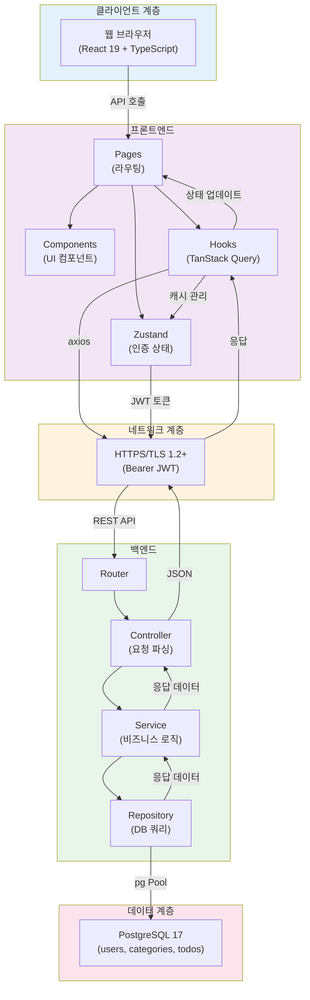
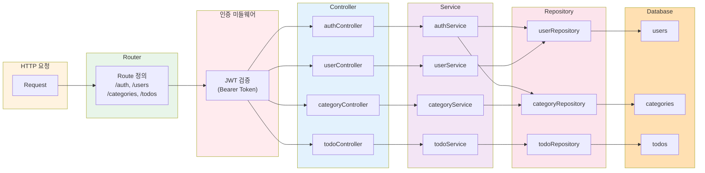
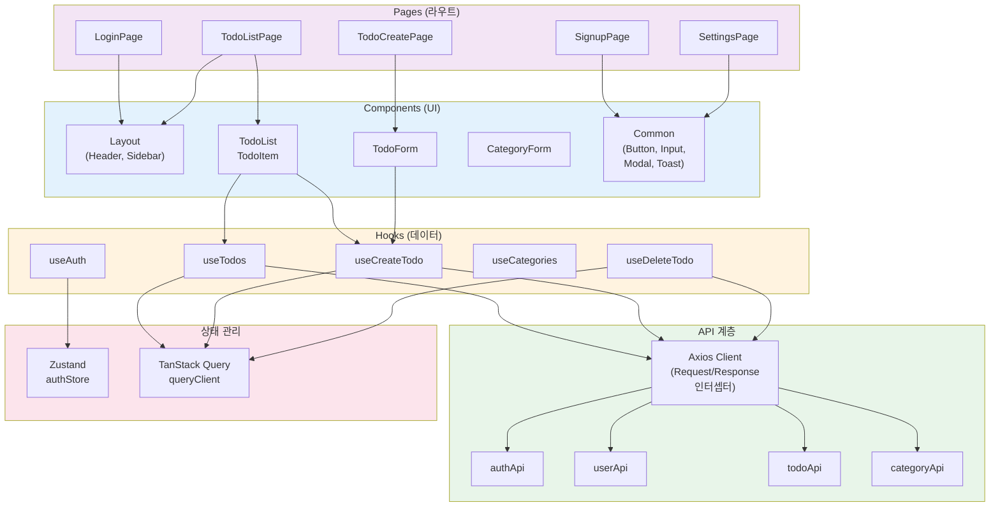
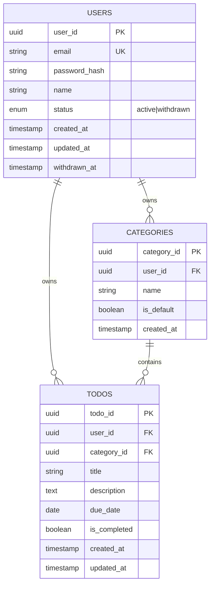
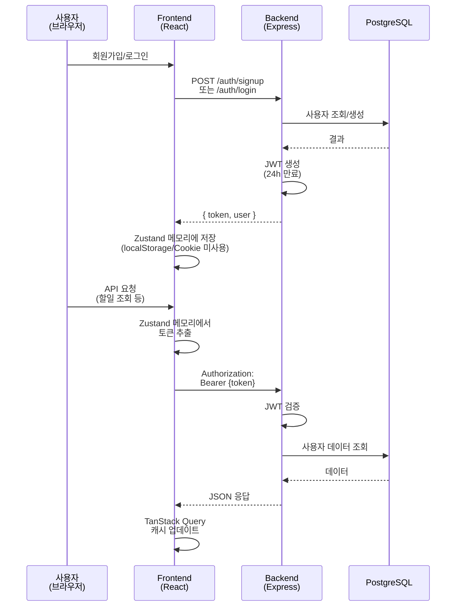
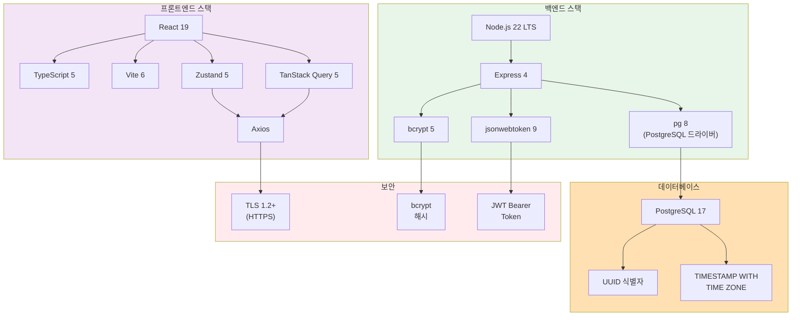
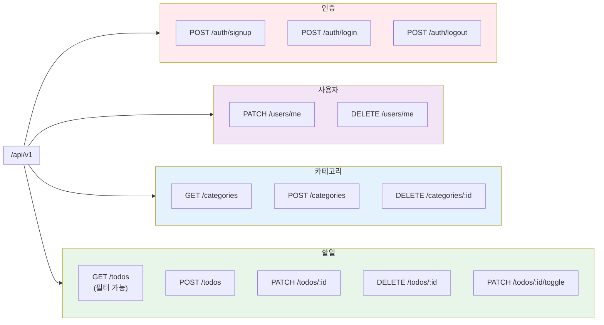

# TodoListApp 기술 아키텍처 다이어그램

## 전체 시스템 아키텍처

```mermaid
graph TB
    subgraph Client["클라이언트 계층"]
        Browser["웹 브라우저<br/>(React 19 + TypeScript)"]
    end

    subgraph Frontend["프론트엔드"]
        Pages["Pages<br/>(라우팅)"]
        Components["Components<br/>(UI 컴포넌트)"]
        Hooks["Hooks<br/>(TanStack Query)"]
        Zustand["Zustand<br/>(인증 상태)"]
    end

    subgraph Network["네트워크 계층"]
        HTTPS["HTTPS/TLS 1.2+<br/>(Bearer JWT)"]
    end

    subgraph Backend["백엔드"]
        Router["Router"]
        Controller["Controller<br/>(요청 파싱)"]
        Service["Service<br/>(비즈니스 로직)"]
        Repository["Repository<br/>(DB 쿼리)"]
    end

    subgraph Database["데이터 계층"]
        PostgreSQL["PostgreSQL 17<br/>(users, categories, todos)"]
    end

    Browser -->|API 호출| Pages
    Pages --> Components
    Pages --> Hooks
    Pages --> Zustand
    Hooks -->|axios| HTTPS
    Zustand -->|JWT 토큰| HTTPS
    HTTPS -->|REST API| Router
    Router --> Controller
    Controller --> Service
    Service --> Repository
    Repository -->|pg Pool| PostgreSQL
    Repository -->|응답 데이터| Service
    Service -->|응답 데이터| Controller
    Controller -->|JSON| HTTPS
    HTTPS -->|응답| Hooks
    Hooks -->|상태 업데이트| Pages
    Hooks -->|캐시 관리| Zustand

    style Client fill:#e3f2fd
    style Frontend fill:#f3e5f5
    style Network fill:#fff3e0
    style Backend fill:#e8f5e9
    style Database fill:#fce4ec
```

## 백엔드 레이어 구조

```mermaid
graph LR
    subgraph HTTP["HTTP 요청"]
        Req["Request"]
    end

    subgraph Route["Router"]
        Routes["Route 정의<br/>/auth, /users<br/>/categories, /todos"]
    end

    subgraph Auth["인증 미들웨어"]
        JWT["JWT 검증<br/>(Bearer Token)"]
    end

    subgraph Ctrl["Controller"]
        C1["authController"]
        C2["userController"]
        C3["categoryController"]
        C4["todoController"]
    end

    subgraph Svc["Service"]
        S1["authService"]
        S2["userService"]
        S3["categoryService"]
        S4["todoService"]
    end

    subgraph Rep["Repository"]
        R1["userRepository"]
        R2["categoryRepository"]
        R3["todoRepository"]
    end

    subgraph DB["Database"]
        Users["users"]
        Categories["categories"]
        Todos["todos"]
    end

    Req --> Routes
    Routes --> JWT
    JWT --> C1
    JWT --> C2
    JWT --> C3
    JWT --> C4
    C1 --> S1
    C2 --> S2
    C3 --> S3
    C4 --> S4
    S1 --> R1
    S1 --> R2
    S2 --> R1
    S3 --> R2
    S4 --> R3
    R1 --> Users
    R2 --> Categories
    R3 --> Todos

    style HTTP fill:#fff3e0
    style Route fill:#e8f5e9
    style Auth fill:#ffebee
    style Ctrl fill:#e3f2fd
    style Svc fill:#f3e5f5
    style Rep fill:#fce4ec
    style DB fill:#ffe0b2
```

## 프론트엔드 구조

```mermaid
graph TB
    subgraph Pages["Pages (라우트)"]
        P1["LoginPage"]
        P2["SignupPage"]
        P3["TodoListPage"]
        P4["TodoCreatePage"]
        P5["SettingsPage"]
    end

    subgraph Components["Components (UI)"]
        C1["Layout<br/>(Header, Sidebar)"]
        C2["TodoList<br/>TodoItem"]
        C3["TodoForm"]
        C4["CategoryForm"]
        C5["Common<br/>(Button, Input,<br/>Modal, Toast)"]
    end

    subgraph Hooks["Hooks (데이터)"]
        H1["useTodos"]
        H2["useCreateTodo"]
        H3["useDeleteTodo"]
        H4["useCategories"]
        H5["useAuth"]
    end

    subgraph API["API 계층"]
        AX["Axios Client<br/>(Request/Response<br/>인터셉터)"]
        Auth["authApi"]
        User["userApi"]
        Todo["todoApi"]
        Category["categoryApi"]
    end

    subgraph State["상태 관리"]
        ZU["Zustand<br/>authStore"]
        TQ["TanStack Query<br/>queryClient"]
    end

    P1 --> C1
    P2 --> C5
    P3 --> C1
    P3 --> C2
    P4 --> C3
    P5 --> C5
    C2 --> H1
    C2 --> H2
    C3 --> H2
    H1 --> AX
    H2 --> AX
    H3 --> AX
    H5 --> ZU
    AX --> Auth
    AX --> User
    AX --> Todo
    AX --> Category
    H1 --> TQ
    H2 --> TQ
    H3 --> TQ

    style Pages fill:#f3e5f5
    style Components fill:#e3f2fd
    style Hooks fill:#fff3e0
    style API fill:#e8f5e9
    style State fill:#fce4ec
```

## 데이터 모델 관계도

```mermaid
erDiagram
    USERS ||--o{ CATEGORIES : owns
    USERS ||--o{ TODOS : owns
    CATEGORIES ||--o{ TODOS : contains

    USERS {
        uuid user_id PK
        string email UK
        string password_hash
        string name
        enum status "active|withdrawn"
        timestamp created_at
        timestamp updated_at
        timestamp withdrawn_at
    }

    CATEGORIES {
        uuid category_id PK
        uuid user_id FK
        string name
        boolean is_default
        timestamp created_at
    }

    TODOS {
        uuid todo_id PK
        uuid user_id FK
        uuid category_id FK
        string title
        text description
        date due_date
        boolean is_completed
        timestamp created_at
        timestamp updated_at
    }
```

## 인증 흐름

```mermaid
sequenceDiagram
    participant User as 사용자<br/>(브라우저)
    participant FE as Frontend<br/>(React)
    participant API as Backend<br/>(Express)
    participant DB as PostgreSQL

    User->>FE: 회원가입/로그인
    FE->>API: POST /auth/signup<br/>또는 /auth/login
    API->>DB: 사용자 조회/생성
    DB-->>API: 결과
    API->>API: JWT 생성<br/>(24h 만료)
    API-->>FE: { token, user }
    FE->>FE: Zustand 메모리에 저장<br/>(localStorage/Cookie 미사용)
    
    User->>FE: API 요청<br/>(할일 조회 등)
    FE->>FE: Zustand 메모리에서<br/>토큰 추출
    FE->>API: Authorization:<br/>Bearer {token}
    API->>API: JWT 검증
    API->>DB: 사용자 데이터 조회
    DB-->>API: 데이터
    API-->>FE: JSON 응답
    FE->>FE: TanStack Query<br/>캐시 업데이트
```

## 기술 스택 요약

```mermaid
graph TB
    subgraph Frontend_Stack["프론트엔드 스택"]
        FW["React 19"]
        TS["TypeScript 5"]
        VT["Vite 6"]
        ZS["Zustand 5"]
        TQ["TanStack Query 5"]
        AX["Axios"]
    end

    subgraph Backend_Stack["백엔드 스택"]
        NJ["Node.js 22 LTS"]
        EX["Express 4"]
        PG["pg 8<br/>(PostgreSQL 드라이버)"]
        JWT["jsonwebtoken 9"]
        BC["bcrypt 5"]
    end

    subgraph Database_Stack["데이터베이스"]
        PSQL["PostgreSQL 17"]
        UUID["UUID 식별자"]
        TZ["TIMESTAMP WITH<br/>TIME ZONE"]
    end

    subgraph Security["보안"]
        TLS["TLS 1.2+<br/>(HTTPS)"]
        BCP["bcrypt<br/>해시"]
        JWTB["JWT Bearer<br/>Token"]
    end

    FW --> TS
    FW --> VT
    FW --> ZS
    FW --> TQ
    ZS --> AX
    TQ --> AX
    NJ --> EX
    EX --> PG
    EX --> JWT
    EX --> BC
    PG --> PSQL
    PSQL --> UUID
    PSQL --> TZ
    AX --> TLS
    JWT --> JWTB
    BC --> BCP

    style Frontend_Stack fill:#f3e5f5
    style Backend_Stack fill:#e8f5e9
    style Database_Stack fill:#ffe0b2
    style Security fill:#ffebee
```

## API 엔드포인트 맵

```mermaid
graph LR
    subgraph Auth["인증"]
        A1["POST /auth/signup"]
        A2["POST /auth/login"]
        A3["POST /auth/logout"]
    end

    subgraph User["사용자"]
        U1["PATCH /users/me"]
        U2["DELETE /users/me"]
    end

    subgraph Category["카테고리"]
        C1["GET /categories"]
        C2["POST /categories"]
        C3["DELETE /categories/:id"]
    end

    subgraph Todo["할일"]
        T1["GET /todos<br/>(필터 가능)"]
        T2["POST /todos"]
        T3["PATCH /todos/:id"]
        T4["DELETE /todos/:id"]
        T5["PATCH /todos/:id/toggle"]
    end

    subgraph Prefix["/api/v1"]
    end

    Prefix --> Auth
    Prefix --> User
    Prefix --> Category
    Prefix --> Todo

    style Auth fill:#ffebee
    style User fill:#f3e5f5
    style Category fill:#e3f2fd
    style Todo fill:#e8f5e9
```
