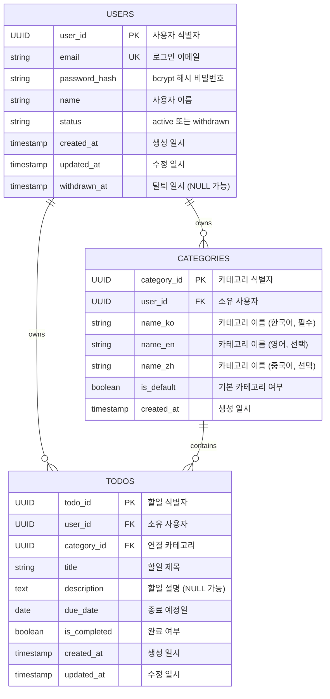

# ERD

## 인덱스 전략

| 테이블 | 인덱스 컬럼 | 인덱스 유형 | 목적 |
|--------|-------------|-------------|------|
| users | email | UNIQUE INDEX | 중복 방지 및 로그인 조회 성능 |
| categories | (user_id, name_ko) | UNIQUE INDEX | 카테고리 한국어 이름 중복 방지 |
| categories | user_id | INDEX | 사용자별 카테고리 목록 조회 |
| todos | user_id | INDEX | 사용자별 할일 목록 조회 |
| todos | (user_id, category_id) | INDEX | 카테고리 필터 조회 |
| todos | (user_id, due_date) | INDEX | 기간 필터 조회 |
| todos | (user_id, is_completed) | INDEX | 완료여부 필터 조회 |
