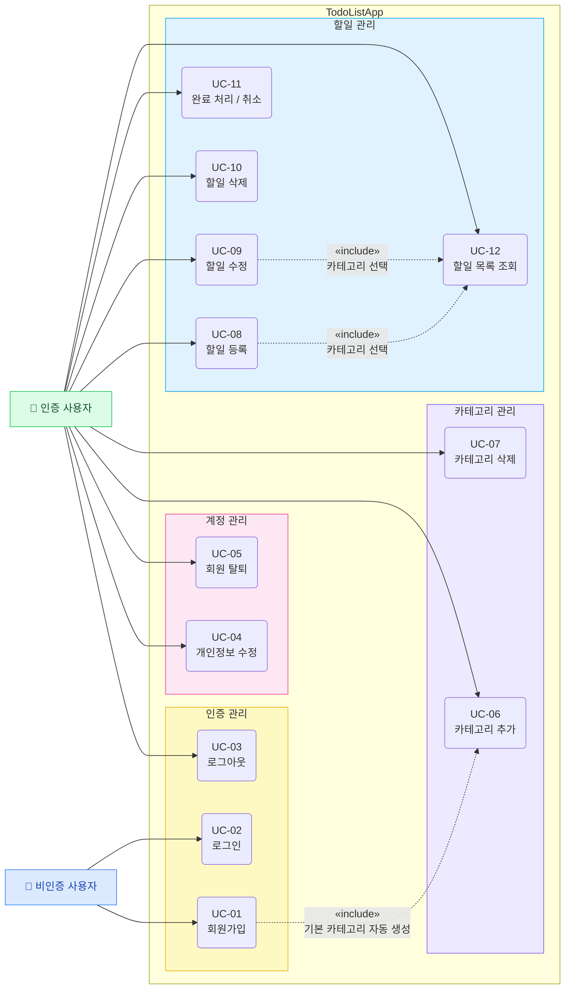

# TodoListApp — Use Case Diagram

---

## 액터 정의

| 액터 | 설명 |
|------|------|
| 비인증 사용자 | 시스템에 로그인되어 있지 않은 상태의 사용자 |
| 인증 사용자 | 이메일/비밀번호로 로그인하여 JWT를 보유한 사용자 (`status = active`) |

---

## 유스케이스 목록

| UC-ID | 유스케이스 | 액터 | 관련 BR |
|-------|-----------|------|---------|
| UC-01 | 회원가입 | 비인증 사용자 | BR-03, BR-04, BR-09, BR-10 |
| UC-02 | 로그인 | 비인증 사용자 | BR-01, BR-09 |
| UC-03 | 로그아웃 | 인증 사용자 | BR-01 |
| UC-04 | 개인정보 수정 | 인증 사용자 | BR-01, BR-02, BR-10 |
| UC-05 | 회원 탈퇴 | 인증 사용자 | BR-01, BR-02, BR-09 |
| UC-06 | 카테고리 추가 | 인증 사용자 | BR-01, BR-02 |
| UC-07 | 카테고리 삭제 | 인증 사용자 | BR-01, BR-02, BR-05, BR-06 |
| UC-08 | 할일 등록 | 인증 사용자 | BR-01, BR-02, BR-07 |
| UC-09 | 할일 수정 | 인증 사용자 | BR-01, BR-02, BR-07 |
| UC-10 | 할일 삭제 | 인증 사용자 | BR-01, BR-02 |
| UC-11 | 완료 처리 / 취소 | 인증 사용자 | BR-01, BR-02, BR-08 |
| UC-12 | 할일 목록 조회 | 인증 사용자 | BR-01, BR-02 |

---

## «include» 관계 설명

| 관계 | 설명 |
|------|------|
| UC-01 → UC-06 | 회원가입 시 기본 카테고리(일반·업무·개인) 3개 자동 생성 (BR-04) |
| UC-08 → UC-12 | 할일 등록 시 사용자 카테고리 목록을 조회하여 카테고리 선택 |
| UC-09 → UC-12 | 할일 수정 시 사용자 카테고리 목록을 조회하여 카테고리 재선택 |
